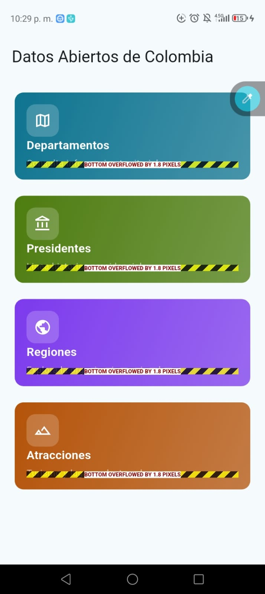
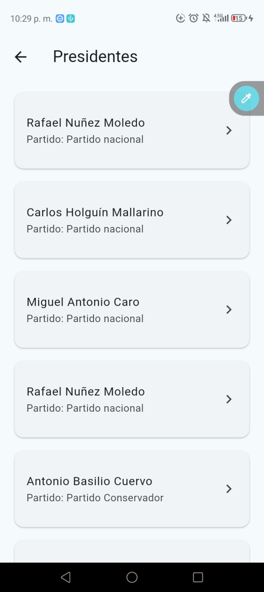

# Taller Datos Abiertos de Colombia - Flutter

Aplicacion Flutter que consume la API publica de Colombia para mostrar informacion de departamentos, presidentes, regiones y atracciones turisticas.

## Endpoints usados

Base URL configurada:

`https://api-colombia.com/api/v1`

| Endpoint | URL |
|---|---|
| Department (listado) | https://api-colombia.com/api/v1/Department |
| Department (detalle) | https://api-colombia.com/api/v1/Department/{id} |
| President (listado) | https://api-colombia.com/api/v1/President |
| President (detalle) | https://api-colombia.com/api/v1/President/{id} |
| Region (listado) | https://api-colombia.com/api/v1/Region |
| Region (detalle) | https://api-colombia.com/api/v1/Region/{id} |
| TouristicAttraction (listado) | https://api-colombia.com/api/v1/TouristicAttraction |
| TouristicAttraction (detalle) | https://api-colombia.com/api/v1/TouristicAttraction/{id} |

## Arquitectura

El proyecto sigue una separacion por capas para mantener el codigo ordenado y escalable:

- `lib/models/`: define las entidades y el mapeo `fromJson`/`toJson`.
- `lib/services/`: centraliza el consumo HTTP, manejo de errores y parseo de respuestas.
- `lib/views/`: contiene las pantallas (dashboard, listado y detalle).
- `lib/routes/`: define la navegacion con `go_router` y parametros por ruta.

## Paquetes usados

- `http`: para realizar solicitudes HTTP a la API.
- `go_router`: para la navegacion declarativa con rutas dinamicas.
- `flutter_dotenv`: para cargar variables de entorno desde `.env`.

## Rutas implementadas

- `/` -> Dashboard principal.
- `/list/:type` -> Listado generico por tipo (`departments`, `presidents`, `regions`, `attractions`).
- `/detail/:type/:id` -> Detalle de un recurso por tipo e identificador.

## Ejemplo JSON (Department)

```json
{
	"id": 5,
	"name": "Antioquia",
	"description": "Departamento ubicado en la region Andina",
	"cityCapitalId": 11001,
	"municipalities": 125,
	"surface": 63612.0,
	"population": 6774597.0,
	"phonePrefix": "4",
	"countryId": 1,
	"regionId": 2
}
```

## Capturas de pantalla

### Dashboard


### Listado


### Detalle

